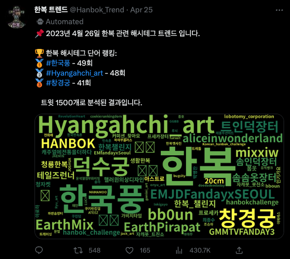

# Hanbok-Trend 🌟
### A Twitter Bot that creates wordclouds and tweets them. 🐦



This Twitter bot pulls tweets that include the keyword 한복 (Hanbok: Korean traditional costume) every day at 00:00 and generates a wordcloud from them. It then tweets the wordcloud image.

After posting the image, the bot stores the image and CSV file containing the data of the tweet in the archive folder. 📁 (You can find all the images and CSV files posted by the bot in the archive folder)

Additionally, it has additional features such as creating a header based on the number of tweets that contain the keyword 한복 and generating a graph from it. 📈

You can find the bot that was running this code for over half a year, but unfortunately, it is no longer active due to Twitter API changes that require a $100 payment. You can check it out [here](https://twitter.com/Hanbok_Trend).

## File Structure
```
Hanbok-Trend
├── archive
│   ├── csv (CSV files containing tweet data)
│   ├── tags (Wordcloud images of hashtags)
│   └── words (Wordcloud images of tweets)
├── header (Code for creating header images)
├── media (Images for README.md)
├── tweet_stream (Code for subscribing to Twitter Stream API)
└── main.py (Main code)
```

## Setup 🛠️
1. Clone this repository
1. Install dependencies
    ```
    pip install -r requirements.txt
    ```
1. Create a Twitter app and obtain the API keys
1. Run main.py (You can use run.sh)
1. If you want to use the header feature, you must run tweet_stream/main.py, which will subscribe to the Twitter Stream API and save the data to a Redis database.
1. To install Redis, check here.
1. After running tweet_stream/main.py, you can run header/main.py, which will create header images based on the data in the Redis database.
